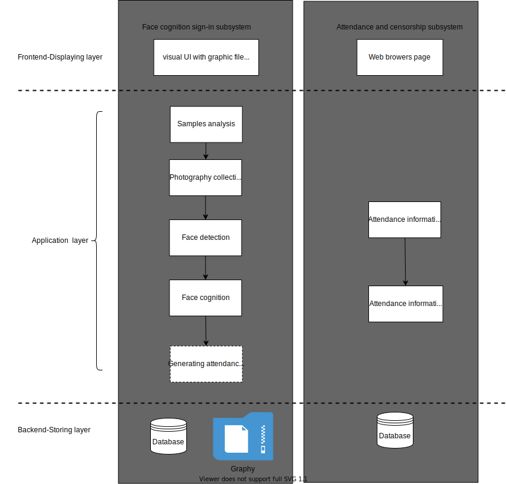

## Design Document
### Purpose
The Face Cognition Sign-in system
### General priority
Objectivize functional requirement at full length  in [Requirement_Document](./Requirement_Document.md).

Device priority:
1. IDE : Pycharm / Anaconda 
2. Exterior device : camera
3. CPU efficiency: at least 800M 
4. Network bandwidth efficiency:
   - Upload : 5 Mbps
   - Download : 5 Mbps  
5. Memory efficiency: 
   - Must not consume over 200MB of RAM.
   - required memory 128M  
   
System priority:
1. Security: SSH and users' privilege licence  
2. Maintainability: small data capacity, limited throughput
3. Portability: web-end supporting different browsers, client-end software about 150MB supporting different OS  
### Outline of Design
Review the requirement:

### Major design issue
+ Face recognition 
  
   Improving accuracy rate of cognition -- comparing APIs and modules and referred by repositories in Github  
   
   considering the trained dataset in the modules whether reach practical scenarios
   
   specific factor, such as shadow, light source, masks and glasses students wearing 
   
   cost of mass samples training  

+ Registration and Storage
  
   stability of database, designing with less coupling (data couple) and more reusable, increase cohesion

   flexible interface for administrators to change and update

   particular authorities for teachers and administrators to manage 
### Details 
> 
> Specific task list:
>  - [ ] Environment constructing for every programmer
>  - [ ] UML diagram design
>  - [ ] Django deployment on Cloud.
>  - [ ] Webpage design and UI design.
>  - [ ] SQL programming.
>  - [ ] Modification of face recognition.
>  - [ ] Documentation following the pace.

**UML**
1. Class UML

   

2. Sequence UML
 
   

**Architectural Model**

- Multi-layer architecture pattern

   For system's architecture, we have different components following Top-down design. 

   First design high level structure of the system, which is the product for users(students and teacher), for example, the UI layout and widgets prepared for next layer.

   Then gradually work down to detailed decisions about low-level constructs -- application which including the processing flow in face detection and cognition that will be used and the format of particular data items, specifically looking up Functional requirement in [Requirement_Document](./Requirement_Document.md).

   Besides, each layer itself can use Bottom-top design to realize reusability of components. For example, make decisions about reusable utilities including framework for output and individual algorithms for face cognition. 
   

- Client-Service and distributed architectural pattern 
  
   it is simply to separate the client component and service component
   
- Service-orientated architectural pattern (TBD, not necessary)
   
   If we develop our vocational business in future, it is possible to consider organizing a cloud application as a collection of services that communicates using well-defined interfaces. ()

