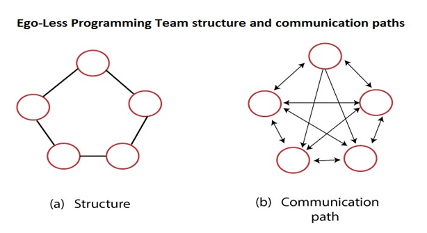
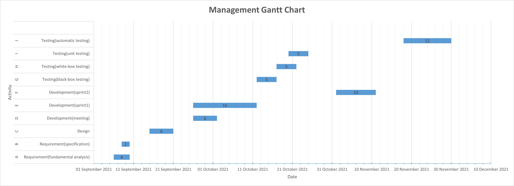

## Management and Maintenance Document
### Software Engineering Team

**Egoless Team**

Our software engineering team is organized within an egoless and democratic management module.
The objective of the group is set by consensus, and ideas from each member is taken for significant decisions. Group leadership revolves among members. Due to its nature, the structure allows input from all representatives, which can lead to better decisions in various problems. This suggests that the method is well suited for long-term research-type projects with less time constraints.

### PERT Chart

### Gantt Chart

### Software Quality Assurance

**CMM2 Model** -- repeatable and owning project-level thinking. 
- Use the basic project management process to track the progress, function and quality of the project. 
- Previous project experience can be applied to the current project. 
- Use a certain degree of organization and basic software testing behaviors, such as software testing plans. 
- Test Case Key Process Area (KPA): demand management, project planning, project supervision and control, supplier agreement management, measurement and analysis, process and product quality assurance, configuration management