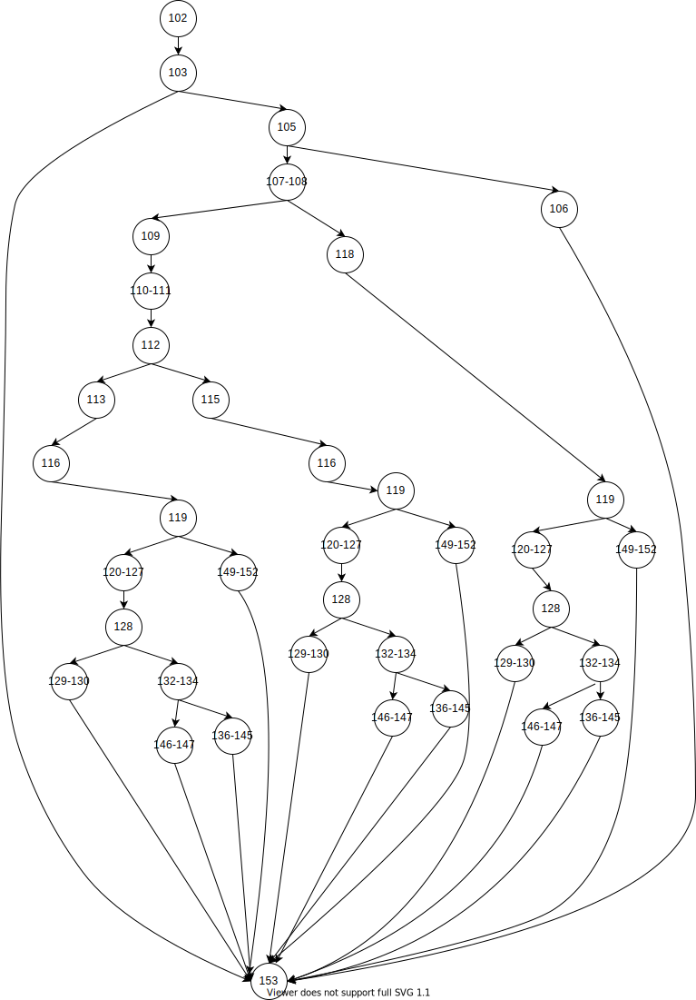

# Test Document
- [Test Document](#test-document)
  - [Black-Box Testing](#black-box-testing)
  - [White-Box Testing](#white-box-testing)
    - [Static White-Box Testing](#static-white-box-testing)
    - [Dynamic White-Box Testing](#dynamic-white-box-testing)
  - [Unit Testing](#unit-testing)
  - [Automatic Testing](#automatic-testing)
## Black-Box Testing
Equivalence class:  
1. M1 = {input sid valid}
2. M2 = {input sid invalid}
3. M3 = {input sid null}
4. D1 = {input sname valid}
5. D2 = {input sname invalid}
6. D3 = {input sname null}
Condition Stub:  

1. C1: input sid in {M1,M2,M3}
2. C2: input sname in {D1,D2,D3}
3. C3: whether take photo in {yes, no}
4. C4: press the add button

Action Stub:  

1. A1: registration success
2. A2: Error exception

Effect Diagram:


Decision table:  
| Rules stub           | 1   | 2   | 3   | 4   | 5   | 6   | 7   | 8   | 9   | 10  |
|----------------------|-----|-----|-----|-----|-----|-----|-----|-----|-----|-----|
| C1:input sid state   | M1  | M1  | M1  | M2  | M2  | M2  | M3  | M3  | M3  | -   |
| C2:input sname state | D1  | D2  | D3  | D1  | D2  | D3  | D1  | D2  | D3  | -   |
| C3:take photo state  | yes | yes | yes | yes | yes | yes | yes | yes | yes | no  |
| C4:press button      | yes | yes | yes | yes | yes | yes | yes | yes | yes | yes |
| A1:Success           | ✔   |     |     |     |     |     |     |     |     |     |
| A2:Error exception   |     | ✔   | ✔   | ✔   | ✔   | ✔   | ✔   | ✔   | ✔   |     |  

Test cases:
| sample number | sample operations                                                      | sample input            | sample output         |
|---------------|------------------------------------------------------------------------|-------------------------|-----------------------|
| 001           | input valid sid <br /> input valid sname<br>   take photo<br>   press button   | 1809853zi0110099<br>   cr   | Registration succeed! |
| 002           | input valid sid<br>   input invalid sname<br>   take photo<br>   press button      | 1809853zi0110098<br>   123  | Error exception!      |
| 003           | input valid sid<br>   input null sname<br>   take photo<br>   press button         | 1809853ji0110097<br>   ""   | Error exception!      |
| 004           | input invalid sid<br>   input valid sname<br>   take photo<br>   press button      | 1809853@iohqwer!<br>   cyx  | Error exception!      |
| 005           | input invalid sid<br>   input invalid sname<br>   take photo<br>   press button    | 1809!@#$%^&*()<br> hpl  | Error exception!      |
| 006           | input invalid sid<br>   input null sname<br>   take photo<br>   press button       | 1809😂😂😂😂 <br>  ""          | Error exception!      |
| 007           | input null sid<br>   input valid sname<br>   take photo<br>   press button         | ""<br>wyy                | Error exception!      |
| 008           | input null sid<br>   input invalid sname<br>   take photo<br>   press button       | ""<br>(^-^)(^-^)(^-^)    | Error exception!      |
| 009           | input null sid<br>   input null sname<br>   take photo<br>   press button          | ""<br>""                 | Error exception!      |
| 010           | input null/(in)valid sid<br>   input null/(in)valid sname<br>   press button   | 1809853zi0110099<br>   cr   | Error exception       |   
> `""""` means null value
## White-Box Testing
### Static White-Box Testing 
Static Testing Tool

In order to fix static logic bugs and identify code styles, including naming regulation, import order and variable definition, we use the tool -- 
[pylint](https://github.com/PyCQA/pylint) for simple the censor among members.  

For example, the testing result about [showplot.py](../showplot.py) :
```text
************* Module showplot
showplot.py:75:0: C0304: Final newline missing (missing-final-newline)
showplot.py:1:0: C0114: Missing module docstring (missing-module-docstring)
showplot.py:7:0: C0116: Missing function or method docstring (missing-function-docstring)
showplot.py:9:4: C0103: Variable name "re" doesn't conform to snake_case naming style (invalid-name)
showplot.py:12:4: C0103: Variable name "y" doesn't conform to snake_case naming style (invalid-name)
showplot.py:24:0: C0116: Missing function or method docstring (missing-function-docstring)
showplot.py:24:0: R0914: Too many local variables (16/15) (too-many-locals)
showplot.py:26:4: C0103: Variable name "re" doesn't conform to snake_case naming style (invalid-name)
showplot.py:34:12: C0103: Variable name "s" doesn't conform to snake_case naming style (invalid-name)
showplot.py:66:8: C0103: Variable name "a" doesn't conform to snake_case naming style (invalid-name)
showplot.py:66:11: C0103: Variable name "b" doesn't conform to snake_case naming style (invalid-name)
showplot.py:67:30: C0209: Formatting a regular string which could be a f-string (consider-using-f-string)

------------------------------------------------------------------
Your code has been rated at 7.14/10 (previous run: 7.14/10, +0.00)
```

after modifying :
```text
************* Module showplot
--------------------------------------------------------------------
Your code has been rated at 10.00/10 (previous run: 10.00/10, +0.00)
```

Walkthrough :

In the walkthrough, it is also important that after the review, the presenter prepare a report on what problems have been found and how to plan to solve the found software defects, referred by [#10](https://github.com/MUST-Quick-Fry/Face-Recognition-Sign-In-System/pull/10#issue-1052853864)


### Dynamic White-Box Testing 
We use **White Box Test** to test 3 different and critical functions in [`UI/utils.py`](../UI/utils.py)
1. `takePhoto` func
    
    Control FLow Graph:
    
    

    Loop Complexity：

    The loop complexity is 7.  


    Independent Path：

    1. 20 -> 22 -> 25 -> 26 -> 29 -> 30 -> 31 -> 48
    2. 20 -> 22 -> 25 -> 26 -> 29 -> 30 -> 34 -> 35 -> 36-42 -> 43 -> 44-45 -> 48
    3. 20 -> 22 -> 25 -> 26 -> 29 -> 30 -> 34 -> 35 -> 36-42 -> 43 -> 48
    4. 20 -> 22 -> 25 -> 29 -> 30 -> 31 -> 48
    5. 20 -> 22 -> 25 -> 26 -> 29 -> 30 -> 34 -> 35 -> 48
    6. 20 -> 22 -> 25 -> 29 -> 30 -> 34 -> 35 -> 36-42 -> 43 -> 44-45 -> 48
    7. 20 -> 22 -> 25 -> 29 -> 30 -> 34 -> 35 -> 36-42 -> 43 -> 48
    8. 20 -> 22 -> 25 -> 29 -> 30 -> 34 -> 35 -> 48
    9. 20 -> 22 -> 23 -> 48
    10. 20 -> 22 -> 47 -> 48

    Test Cases:

    |              | input                                                                                                                     | expected output |
    |--------------|---------------------------------------------------------------------------------------------------------------------------|-----------------|
    | Test case 1  | userID = 1809853zi0110099<br> os.path.exists(dir) = False<br> opened = False<br>                                                      | Error Exception |
    | Test case 2  | userID = 1809853zi0110099<br> os.path.exists(dir) = False<br> opened = True<br> os.path.exists(img_path)=True<br> unkown_encoding = False<br> | Error Exception |
    | Test case 3  | userID = 1809853zi0110099<br> os.path.exists(dir) = False<br> opened = True<br> os.path.exists(img_path)=True<br> unkown_encoding = True<br>  | Success         |
    | Test case 4  | userID = 1809853zi0110099<br> os.path.exists(dir) = True<br> opened = False<br>                                                       | Error Exception |
    | Test case 5  | userID = 1809853zi0110099<br> os.path.exists(dir) = False<br> opened = True<br> os.path.exists(img_path)=False <br>                       | Error Exception |
    | Test case 6  | userID = 1809853zi0110099<br> os.path.exists(dir) = True<br> opened = True<br> os.path.exists(img_path)=True<br> unknown_encoding = False<br> | Error Exception |
    | Test case 7  | userID = 1809853zi0110099<br> os.path.exists(dir) = True<br> opened = True<br> os.path.exists(img_path)=True<br> unknown_encoding = True<br>  | Success!        |
    | Test case 8  | userID = 1809853zi0110099<br> os.path.exists(dir) = True<br> opened = True<br> os.path.exists(img_path)=False <br>                        | Error Exception |
    | Test case 9  | userID = ""                                                                                                               | Error Exception |
    | Test case 10 | userID = "hahahahaha"                                                                                                     | Error Exception                |

2. `addUser` func

    Control Flow Graph: 
    
    

    Loop Complexity:

    The loop complexity is 5.

    Independent Path:

    1. 50-54 -> 55 -> 56-57 -> 85
    2. 50-54 -> 55 -> 61-62 -> 85
    3. 50-54 -> 55 -> 64-69 -> 70 -> 72 -> 73-78 -> 85
    4. 50-54 -> 55 -> 64-69 -> 70 -> 79 -> 80-81 -> 85
    5. 50-54 -> 55 -> 64-69 -> 82 -> 83-84 -> 85

    Test Cases  
    |             | input                                                                                                                                                               | expected output  |
    |-------------|---------------------------------------------------------------------------------------------------------------------------------------------------------------------|------------------|
    | Test case 1 | os.path.exists(os.path.join(dir, userImg)) = False                                                                                                                  | Error Exception! |
    | Test case 2 | os.path.exists(os.path.join(dir, userImg)) = True userName = "wyy"<br> userID = ""                                                                                      | Error Exception! |
    | Test case 3 | os.path.exists(os.path.join(dir, userImg)) = True userName = "cr"<br> userID = "1809853zi0110099" len(sql3_helper.query(cmd = testsql)) == 0                            | Success!         |
    | Test case 4 | os.path.exists(os.path.join(dir, userImg)) = True userName = "cr"<br> userID = "1809853zi0110099" len(sql3_helper.query(cmd = testsql)) == 0 database statement = false | Error Exception  |
    | Test case 5 | os.path.exists(os.path.join(dir, userImg)) = True userName = "cr"<br> userID = "1809853zi0110099" len(sql3_helper.query(cmd = testsql)) != 0                            | Error Exception  |

3. `execIdentification` func

    Control Flow Graph:
    
    

    Loop Complexity:

    The loop complexity is 6.

    Independent Path:
    1. 102 -> 103 -> 104 -> 140
    2. 102 -> 103 -> 105 -> 106-108 -> 109 -> 110-111 -> 112 -> 113 -> 116 -> 118 -> 119 -> 120-127 -> 128 -> 129-130 -> 140
    3. 102 -> 103 -> 105 -> 106-108 -> 109 -> 110-111 -> 112 -> 113 -> 116 -> 118 -> 119 -> 120-127 -> 128 -> 132-134 -> 140
    4. 102 -> 103 -> 105 -> 106-108 -> 109 -> 110-111 -> 112 -> 113 -> 116 -> 118 -> 119 -> 136-139 -> 140
    5. 102 -> 103 -> 105 -> 106-108 -> 109 -> 110-111 -> 112 -> 115 -> 116 -> 118 -> 119 -> 120-127 -> 128 -> 129-130 -> 140
    6. 102 -> 103 -> 105 -> 106-108 -> 109 -> 110-111 -> 112 -> 115 -> 116 -> 118 -> 119 -> 120-127 -> 128 -> 132-134 -> 140
    7. 102 -> 103 -> 105 -> 106-108 -> 109 -> 110-111 -> 112 -> 115 -> 116 -> 118 -> 119 -> 136-139 -> 140
    8. 102 -> 103 -> 105 -> 106-108 -> 109 -> 118 -> 119 -> 120-127 -> 128 -> 129-130 -> 140
    9. 102 -> 103 -> 105 -> 106-108 -> 109 -> 118 -> 119 -> 120-127 -> 128 -> 132-134 -> 140 
    10. 102 -> 103 -> 105 -> 106-108 -> 109 -> 118 -> 119 -> 136-139 -> 140

    Test Cases
    |              | input                                                                                                                       | expected input   |
    |--------------|-----------------------------------------------------------------------------------------------------------------------------|------------------|
    | Test case 1  | opened = False                                                                                                              | Error Exception! |
    | Test case 2  | opened = True <br> os.path.exists(unknown_path) = True <br> self.count = 0 <br> success = True <br> int(out[0][0]) = 1 <br> | Error Exception! |
    | Test case 3  | opened = True <br> os.path.exists(unknown_path) = True <br> self.count = 0 <br> success = True <br> int(out[0][0]) = 0 <br> | Success!         |
    | Test case 4  | opened = True <br> os.path.exists(unknown_path) = True <br> self.count = 0 <br> success = False <br>                        | Error Exception! |
    | Test case 5  | opened = True <br> os.path.exists(unknown_path) = True <br> self.count = 6 <br> success = True <br> int(out[0][0]) = 0 <br> | Success!         |
    | Test case 6  | opened = True <br> os.path.exists(unknown_path) = True <br> self.count = 6 <br> success = True <br> int(out[0][0]) = 1 <br> | Error Exception! |
    | Test case 7  | opened = True <br> os.path.exists(unknown_path) = True <br> self.count = 6 <br> success = False <br>                        | Error Exception! |
    | Test case 8  | opened = True <br> os.path.exists(unknown_path) = Flase <br> success = True <br> int(out[0][0]) = 1 <br>                    | Error Exception  |
    | Test case 9  | opened = True <br> os.path.exists(unknown_path) = False <br> success = True <br> int(out[0][0]) = 0 <br>                    | Success!         |
    | Test case 10 | opened = True <br> os.path.exists(unknown_path) = False <br> success = False <br>                                           | Error Exception! |

## Unit Testing
Actually, it is necessary to create a test suite a load the test cases in previous testing work. 
We use [unittest](https://docs.python.org/3/library/unittest.html) from **Python Package Index**, the specific codes can referred in [test_unittest.py](../test_unittest.py). 

## Automatic Testing
**Selenium**

We use [**Github Action**](https://docs.github.com/en/actions) to
